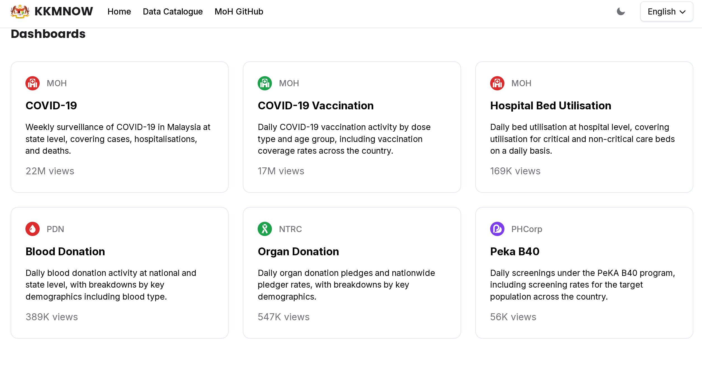

#+TITLE: KKMNow Supplemental Dashboard Project
#+AUTHOR: Aaron Khong Yu Xiang
#+DATE: [2026-04-27]
#+OPTIONS: toc:2 num:nil
#+STARTUP: showeverything inlineimages
#+REVEAL_CENTER: t
* KKM Now Presentation
* Introduction
+ KKMNow is an open source government data repository based off COVIDNow in 2022.

+ It aims to be a public source of information that collates various data collected from government agencies such as
  - Blood donations
  - Infant mortality
  -

* Problem Statement
+ KKMNow has several flaws.
  - Some data (covid19)
* Methodology and Tools
* Outcomes
* Conclusion
* Evaluation
